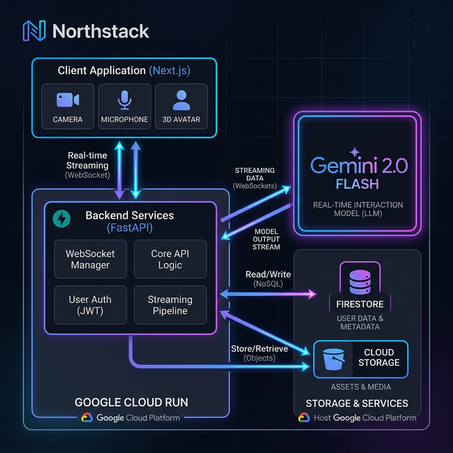
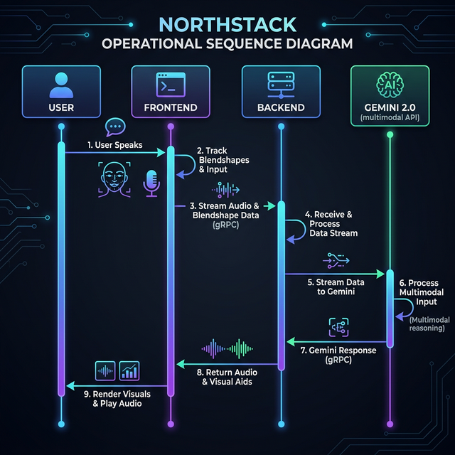
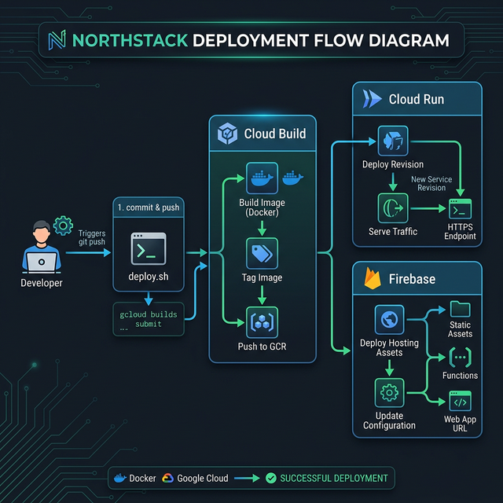

# 🛠️ Northstack: Full Technical Specification

This document provides a deep dive into the architecture, data flow, and deployment mechanics of Northstack.

---

## 1. 🏗️ Global System Architecture
Northstack is built on a modern, event-driven, multimodal architecture. It synchronizes audio, vision, and AI reasoning in real-time.

---

## 2. ⚡ Real-Time Multimodal Data Flow
The core differentiator of Northstack is its sub-second latency for multimodal coaching.

---

## 3. 🚀 Automated Deployment Pipeline
Northstack uses a unified bash script for standardizing deployments across different Google Cloud services.

---

## 4. 🛠️ Tech Stack Summary
| Component | Technology | Role |
| :--- | :--- | :--- |
| **Frontend** | Next.js, React, Tailwind | Core Application UI |
| **Vision** | MediaPipe | Face & Mouth Landmark Tracking |
| **Real-time** | WebSockets | Low-latency bi-directional streaming |
| **Backend** | FastAPI (Python) | Session Orchestration |
| **LLM Orchestration** | Agent Development Kit (ADK) | Managing Gemini Live connections |
| **AI (Text/Audio)** | Gemini 2.0 Flash | Core reasoning and natural speech |
| **AI (Visual)** | Vertex AI Imagen 3 | Scene generation for Storytelling |
| **Hosting** | Google Cloud Run | Serverless backend compute |
| **Storage** | Firestore & Cloud Storage | User data and media assets |

---

## 🔗 Official Links
- **GitHub Repository**: [Northstack](https://github.com/gwaghmar/Northstack)
- **Deployment Script**: [deploy.sh](https://github.com/gwaghmar/Northstack/blob/main/Northstack/deploy.sh)
- **Submission Tag**: #GeminiLiveAgentChallenge
